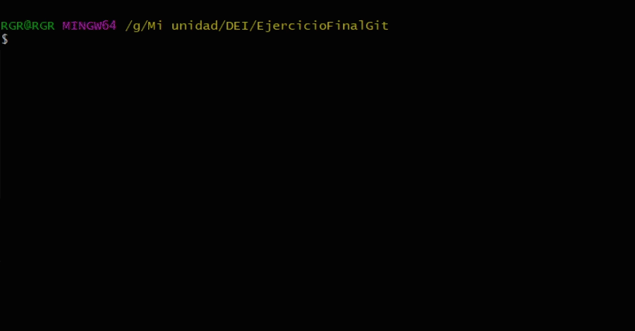

# 
EJERCICIO BÁSICO FINAL GIT

##	
1. CUENTA GITHUB

En primer lugar debemos dirigirnos a [Github](https://github.com/) para **registrarnos** y posteriormente **iniciar sesión**.

---
##	
2. CREAR REPOSITORIO

El siguiente paso será crear nuestro repositorio **CAMPUSCIFF**.

---
##	
3. CLONAR REPOSITORIO

Tenemos el repositorio alojado en [Github](https://github.com/) pero tenemos que **clonarlo** en una carpeta local que en mi caso será <code>_G:\Mi unidad\DEI\EjercicioFinalGit_</code>

---
##	
4. CREAR README y COMMIT

Aunque nosotros creamos el archivo _README.md_ a la hora de crear el repositorio, haremos un nuevo archivo ___README2.md___ para ver como se crearía dicho archivo mediante comandos.  
Además haremos nuestro primer ___COMMIT___.

---
##	
5. PUSH

Ya hemos realizado nuestro primer _COMMIT_ no obstante, los archivos todavía permanecen en nuestro equipo y para enviarlos a nuestro repositorio online debemos realizar un **PUSH**.

---
##	
6. IGNORAR ARCHIVOS

Suele ser habitual el no querer añadir cierto tipos de archivos "basura".  
Para ello debemos crear un archivo ___.gitignore___ en el cual añadiremos aquellos archivos concretos o extensiones en general que queremos que **Git** ignore cuando hacemos un **add**.

Para realizar una prueba en primer lugar crearemos el fichero _privado.txt_ y la carpeta _privada_:

Una vez comprobamos que se han creado con éxito, crearemos el fichero ___.gitignore___ en el que añadiremos los archivos:

Para comprobar que ha funcionado haremos un **add**:

---
##	
7. TAGs

El siguiente paso será crear la primera versión de nuestro repositorio a partir de un ___TAG___. 
Antes de eso crearemos el archivo _1.txt_:

Crearemos el **TAG** sobre el último _COMMIT_ realizado:

Haremos un nuevo _COMMIT_ para "marcar" cuando hemos creado la versión:

Para comprobar que se ha creado correctamente podemos hacer:

Para finalizar subiremos el **TAG** al repositorio online y haremos un último _COMMIT_ indicando que hemos terminado.

---
##	
8. CUENTA GITHUB

* **FOTO DE PERFIL**
  
  
 

* **DOBLE FACTOR DE AUTENTIFICACIÓN**
  
  
 

  
 

  Tras esto recibiremos unos códigos de recuperación que debemos guardar. Y posteriormente enlazar la cuenta con un número de teléfono para la utentificación por ___SMS___ o por ___APP___. Esto último será mi caso. 
  La ___APP___ que yo utilizo es: [OctoPrint](https://play.google.com/store/apps/details?id=com.gh4a)
    
 

	 
    Una vez terminado nos debe aparecer:
    
 

	 

* **SEGUIR COMPAÑEROS**
	 
	<h3 style="text-align: center;">Fran</h2>
	
 

  	<h3 style="text-align: center;">Miriam</h2>
  	
 

  	<h3 style="text-align: center;">David</h2>
  	
 

  	<h3 style="text-align: center;">Miguel</h2>
  	
 

	  
* **SEGUIR REPOSITORIOS Y AÑADIR ESTRELLAS**
	
	Voy a seguir el repositorio de uno de mis compañeros y le añadiré una estrella. Para realizarlo con el resto sería de igual manera.
	
 

---
##	
9. TABLA

| Nombre | Enlace |
| -- |-- |
| Miguel | https://github.com/miguelj93/campusciff.git |
| Miriam | https://github.com/MIRIAM-GIT/campusciff.git |
| David | https://github.com/davidfuentes2755/campusciff.git |

---
##	
10. COLABORADORES

Desde la pestaña _Settings_ y en la opción _Collaborators_ podemos hacer colaborador a otro usuario:

 

---
 

# 
EJERCICIO AVANZADO FINAL GIT

##	
1. RAMA

Crearemos una rama

<code>git branch v2.0</code>

Posicionaremos la carpeta de trabajo en esa rama

<code>git checkout v2.0</code>

 
 

Vamos a añadir un fichero llamado ___1.txt___ y haremos un _COMMIT_ indicándolo.

<pre><code>touch 2.txt
git add .
git commit -m "añadido 2.txt"</code></pre>

 
 

Por último enviaremos la **rama** creada al repositorio online:

<code>git push origin v2.0</code>

 
 
---

##	
2. MERGE

Ahora vamos a hacer un ___MERGE___ o fusión de la rama _master_ con la nueva rama que hemos creado. Para ello debemos posicionarnos en primer lugar en la rama ___master___:

<code>git checkout master</code>

Para posteriormente hacer un merge de la rama **v2.0** en el ___master___.
 

<code>git merge v2.0 -m "merge v2.0 sin conflictos"</code>

 
 

###	
CON CONFLICTO

En esta ocasión realizaremos un _conflicto_ para poder ver lo que sucede cuando simultáneamente queremos modificar un mismo archivo desde dos ramas diferentes y fusionarlas. 
Para ello, en primer lugar modificaremos el archivo ___1.txt___ del ___master___ :
<pre><code>echo "Hola" >> 1.txt
git add .
git commit -m "hola en 1.txt"
</code></pre>
Y después el mismo archivo ___1.txt.___ de la rama ___v2.0___: 
<pre><code>git checkout v2.0
echo "Adios" >> 1.txt
git add .
git commit -m "Adios en 1.txt"
</code></pre>

 
 

Como vemos en la primera rama hemos escrito _"Hola"_ y en la segunda _"Adiós"_ lo que al intentar fusionarlas provocará un conflicto.  
Para poder observarlo nos volveremos a ir a la rama ___master___ y haremos el ___MERGE___ :
<pre><code>git checkout master
git merge v2.0
vim 1.txt</code></pre>

 
 

Como podemos ver ___Git___ nos permite ver cual es el cambio que causa el conflicto:

 
 

###	
LISTADO RAMAS

Antes de arreglar el conflicto causado procederemos a mostrar las ramas que han sufrido un ___MERGE___ y las que no para así observar como el conflicto evita que las ramas sean fusionadas hasta ser resuelto.

 
 

###	
SOLUCION CONFLICTO

Para solucionar el conflicto elegiremos cual de las dos partes del mismo nos interesa conservar y haremos un ___COMMIT___ :
<pre><code>git add .
git commit -m "arreglado merge en 1.txt"
</code></pre>

 
 
---

##	
3. BORRAR

Por último vamos a borrar la rama _v2.0_ para lo cual antes crearemos un ___TAG___ :

<code>git tag v2.0</code>

Ahora la borramos:

<code>git tag v2.0</code>

 
 

##	
4. LISTAR CAMBIOS

Por último mostraremos los distintos ___COMMITS___ y ___TAGS___ realizados:

<pre><code>git config --global alias.list 'log --oneline --decorate --graph --all'
git list</code></pre>

 
 

---
